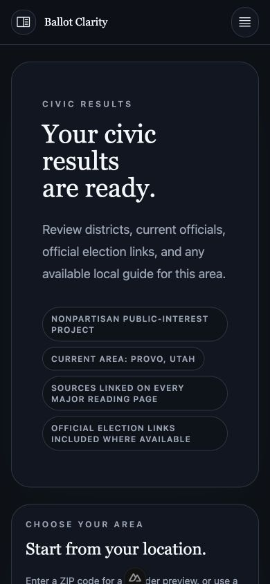
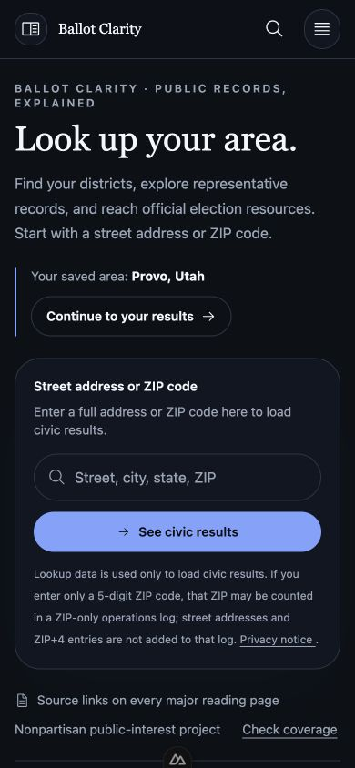
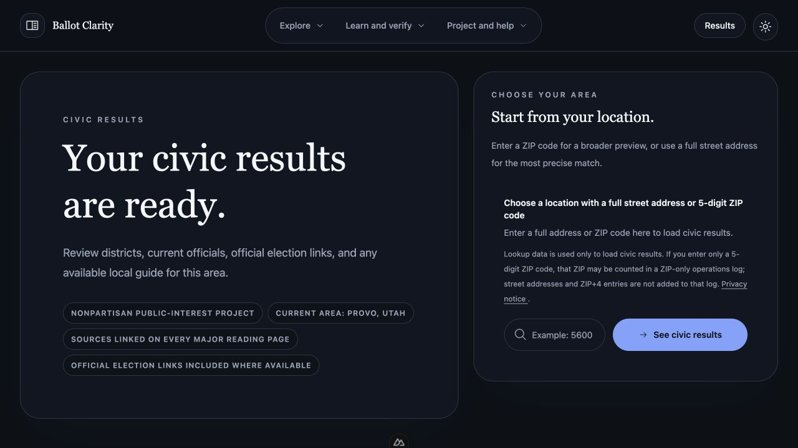
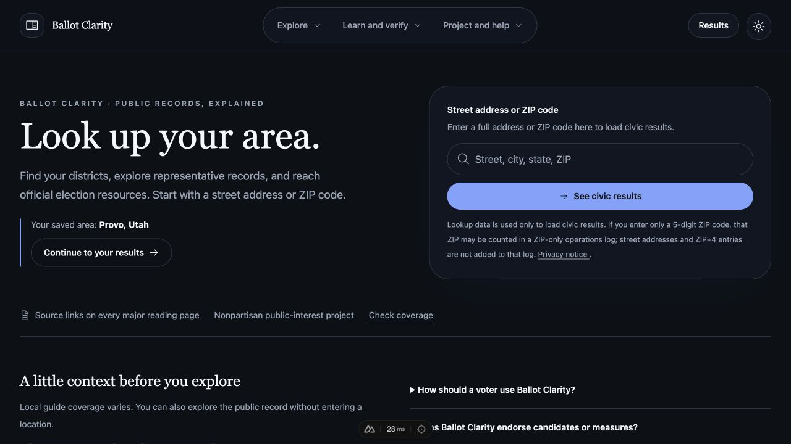
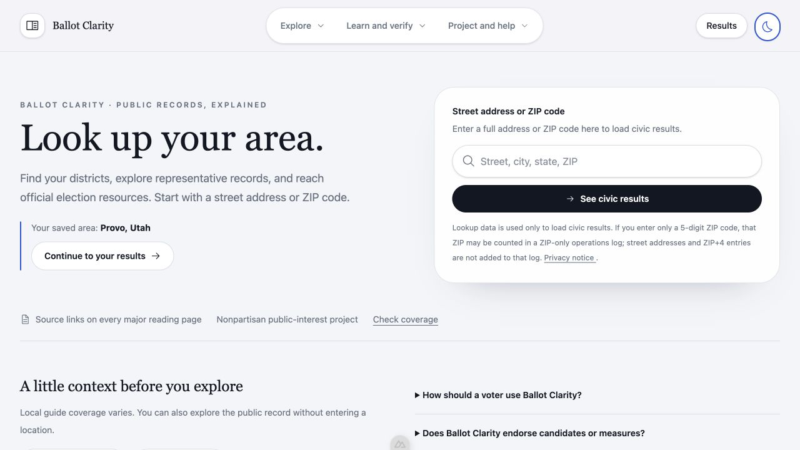
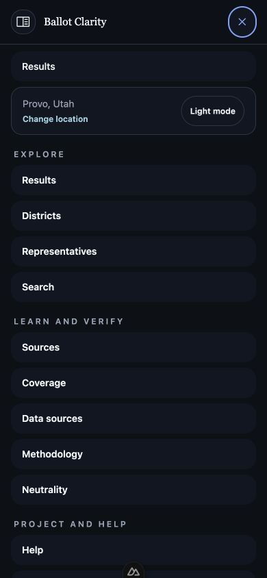
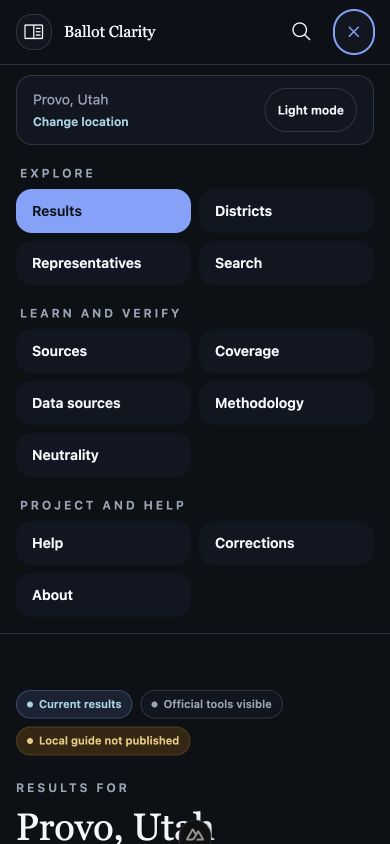
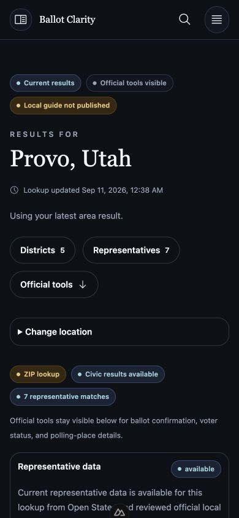
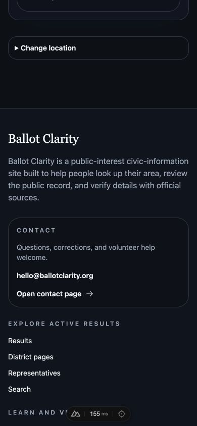
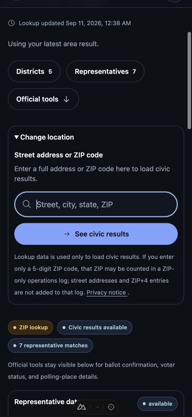

# Layout, navigation, and local setup audit

Audited September 11, 2026, against `ace4fe3` and the changes accompanying this report. This follows the separate [resilience and dependency audit](2026-09-11-site-audit.md). The scope here is the lookup journey, mobile navigation, result navigation, location changes, and developer setup.

The original visual identity already provided clear typography, recognizable controls, source links, and light/dark themes. The main usability costs were repeated introductory copy, deeply nested panels, an address input squeezed by its adjacent button, and navigation that landed on a closed location form. These are corrected while preserving the existing design system and data providers.

## 1. Home entry and returning visitors

**Health: improved and verified at 320, 390, 768, and 1280 pixels wide.**

Before, the saved-area introduction occupied nearly the entire first mobile screen, with the actual lookup input below it. On desktop the input was squeezed into a small part of its card. The new home page places a short introduction next to a single lookup card on desktop and above it on mobile. The input and submit button stack according to their container width. Returning visitors have a direct continuation link, preserving the saved ZIP context. The link changes appropriately when an election overview or verified guide is available.

The field has a concise visible label, 16px input text, and a search keyboard hint. Privacy copy remains visible below the action and associated with the input. Existing FAQ content now appears in expandable questions as well as structured metadata. Search and source browsing remain available without a location.

Mobile, before and after, with the same saved area and 390 × 844 viewport:

| Before | After |
| --- | --- |
|  |  |

Desktop, before and after, at 1280 × 720:

Light-mode check of the same revised desktop layout:

## 2. Mobile navigation

**Health: compact, keyboard-operable, and scrollable when needed.**

The previous menu repeated its primary link and placed every destination in one tall column. The new menu uses two columns within each existing group, removes the repeated action, and bounds the panel to the available viewport with internal scrolling. Search also has a directly accessible header button. Active navigation links expose `aria-current="page"`; Escape and focus return remain covered by browser tests.

At 390 × 844, the full revised menu fits without cutting off its final group. Smaller heights can scroll the panel. This is not a claim of exhaustive device or screen-reader coverage.

| Before | After |
| --- | --- |
|  |  |

## 3. Results and onward navigation

**Health: clearer next steps with connected data verified.**

Results now place district and representative links, including their returned record counts, directly under the location. An official-tools shortcut appears only when its destination is rendered. The results body no longer wraps another large panel or offers a redundant link back to itself. Provider details remain expandable, while unavailable-data explanations stay visible. The previously unhandled guide-action event is connected to the existing published-guide destination resolver.

Local API lookups for two ZIPs and one public civic address returned district and representative records. Both ZIP directory responses contained the same representative names as their lookup responses. The overview link was also followed in the browser to its connected local page. These checks validate software wiring, not the current accuracy or completeness of election content.

## 4. Change location

**Health: fixed on results and ballot-plan entry points.**

Before, the navigation link scrolled to a closed disclosure panel. The new shared component opens the disclosure when the location hash is present, scrolls it into view, and focuses the input. Normal disclosure toggling remains available. Tests cover direct navigation to both `/results#change-location` and `/plan#change-location`; the mobile navigation path was also exercised manually.

| Before | After |
| --- | --- |
|  |  |

## 5. Local setup

**Health: a working single-command preview with explicit preflight.**

The [README](../../README.md#install-and-run) now starts with `nvm use`, root `npm ci`, and `npm run start:local`. The launcher starts the API and Nuxt together with live reload. `npm run doctor:local` checks the Node version, installed dependencies, snapshot path, and port availability without starting either service. Custom ports consistently update both services and their API URLs.

Local startup preserves provider configuration while forcing loopback interfaces, an isolated SQLite admin store, local source-file serving, and no remote Postgres cache. Shell values take precedence over loaded environment files. Existing environment and snapshot files are preserved; no account is bootstrapped implicitly. `.env.local` and `.env.*.local` are now ignored by Git. The README separates optional provider setup, explicit admin bootstrap, and advanced Docker services from the basic preview.

The actual launcher was exercised with configured providers and custom ports. Its shutdown released both listening ports. Automated process tests cover sibling cleanup on failure, interruption, missing executables, invalid ports, and an occupied port without taking over its listener. Process-group cleanup was verified on macOS; Windows descendant-process behavior was not manually exercised.

## Verification and limits

- Root and standalone back-end clean installs passed. Both lockfiles remain unchanged and installable; the package change adds scripts only.
- Production and development dependency freshness was inspected. The root dependency audit reported zero advisories. No dependency versions were changed in this pass.
- Lint, explicit launcher/test lint, typecheck, and the full front-end/back-end build passed.
- 425 unit tests passed with no skips, including the Postgres-backed tests using a temporary local database. All six launcher tests passed after the final environment-alignment change.
- All 20 browser tests passed with no skips, covering responsive input geometry, saved-area continuation, location-panel focus, unavailable-data explanations, blocked storage, stale requests, navigation, SSR, routing, metadata, and security headers.
- Axe passed 48 route/theme checks across 24 routes in light and dark modes. This combines automated checks with the captured visual and keyboard checks; it is not a full accessibility certification.
- Real configured-provider checks exercised lookup, district and representative directories, search, and five rendered routes. Browser screenshots use that local runtime, not invented results or old audit captures.

All ten screenshots were captured in this audit, saved, reopened, and inspected. The matching before/after home views use the same viewport and saved-area state. Local development controls may appear at the bottom of captures.

The reviewed preview snapshot is dated April 24, 2026 and represents official logistics only. Election dates, deadlines, officeholders, candidates, and ballot content were not re-researched or republished in this layout pass. This report does not certify their freshness. Admin content editing, a complete assistive-technology matrix, and production deployment were outside the manual walkthrough. A pushed source release is separate from verified live deployment.
