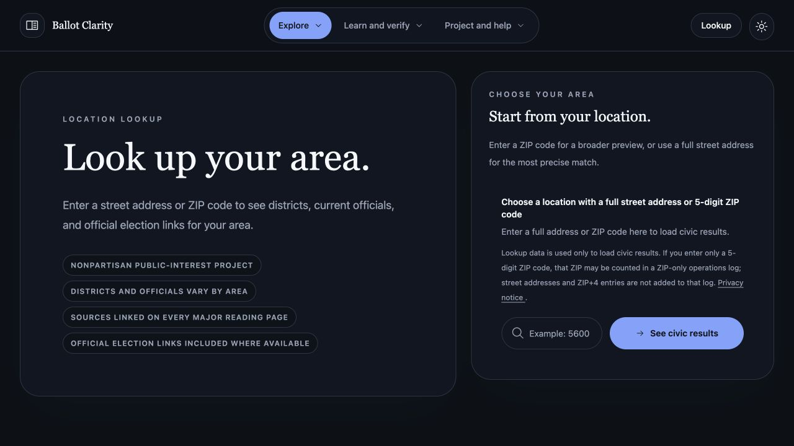
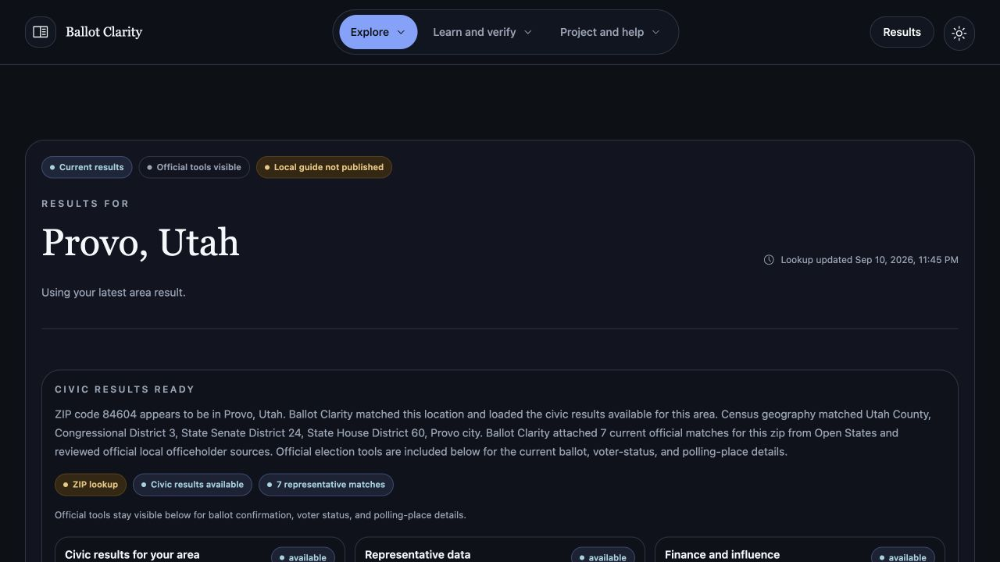
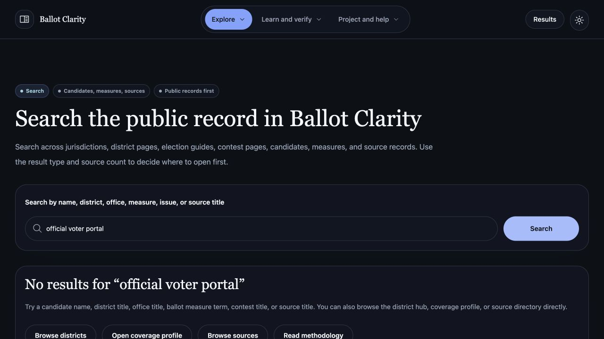
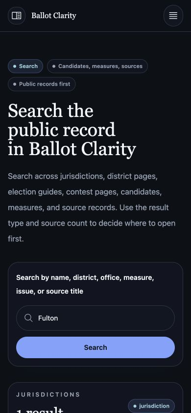
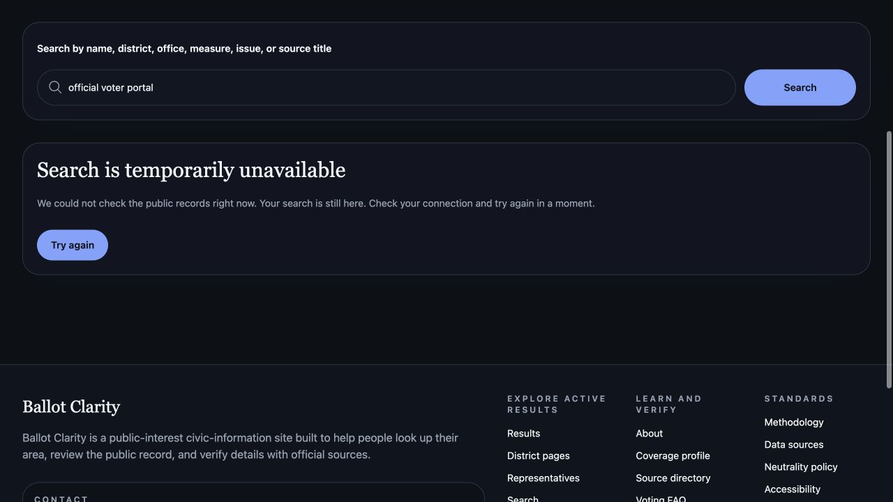
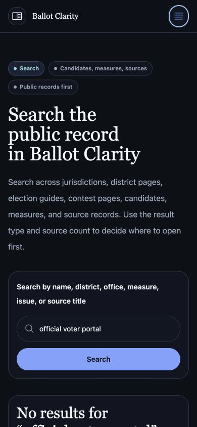

# Site reliability and usability audit

Audit performed September 10–11, 2026 against the local application. Baseline: `cfae554930b9e6070e991bc608b7a968d0227a1d`, after bringing the initially clean checkout forward from `d8b130b`. Toolchain: Node 24.18.1, npm 12.0.2. This report records software behavior; it does not certify election facts or production deployment.

## Scope and outcome

The audit followed a visitor from address/ZIP entry into results, district and representative directories, search, and mobile navigation. It also exercised failure recovery, stored preferences, delayed requests, dependency security, CI safeguards, database integration, and accessibility checks. The identified defects were corrected without changing election content or API contracts.

| Finding | User or operator consequence | Implemented change | Verification |
| --- | --- | --- | --- |
| Storage writes could throw during hydration and lookup | Full or restricted browser storage could leave the app waiting or interrupt successful navigation | Preserve in-memory state, catch persistence failures, and explain how to retain a plan | Browser test forces a quota error, then successfully looks up an area |
| Saved preferences accepted malformed values | A non-string comparison entry or invalid plan could break initialization | Normalize saved comparison choices, issues, ballot view, and plan entries | Three utility tests and a browser hydration regression |
| Old lookup requests could win after input changed | Visitors could reach results for a superseded query; automatic guesses could replace a manual choice | Cancel obsolete requests, ignore late responses, and abort automatic guessing when a manual lookup starts | Delayed manual-response and automatic-guess browser regressions |
| Search outages appeared as zero matches; metadata stayed stale | A failed service looked like missing records, and the document title could describe the previous search | Distinct failure state, retained input, retry button, same-query refresh, and reactive page metadata | Forced HTTP 503, successful retry, and updated document title |
| Escape did not close mobile navigation or consistently restore focus | Keyboard users could lose their place when dismissing navigation | Close menus and return focus to the invoking control; connect mobile toggles to their panel | Mobile and desktop browser assertions plus manual keyboard check |
| Dependency and workflow checks needed repair | Four dependency advisories remained; the action-pin test missed shorthand steps and rejected valid SHA updates | Apply patched overrides in both dependency trees; check immutable action references in both step formats | Clean installs, zero-advisory audits, signatures, full tests |

## Observed journey and screenshots

1. **Home and lookup entry: healthy layout, fragile failure handling corrected.** The desktop entry point clearly labels the address/ZIP field and explains the available public records. Its presentation was retained. The audit concentrated on blocked storage and changing input during a pending lookup, both reproduced in the original build.

   

2. **Lookup results: useful scope distinctions retained.** The local provider-backed lookup produced a populated result page and distinguished directory matches from the availability of a published guide. ZIP lookups, corresponding directory payloads, and rendered routes were checked together. No additional coverage was inferred from a successful lookup.

   

3. **Search failure: misleading empty state corrected.** With the local API unavailable, the original page claimed there were no results. This conflated a failed request with a successful search that found nothing. The original client-side title could also retain the previous query.

   

4. **Mobile search: healthy layout retained.** At 390 CSS pixels, the label wraps legibly and the input and submit button stack within the viewport. Result cards remain readable. This inspection did not justify a visual redesign.

   

5. **Search recovery: explicit and actionable.** The corrected page identifies the outage, preserves the query, and offers a retry. The screenshot shows the entire error panel and its control. A browser regression restores the API response and confirms that retry returns results and updates the title.

   

6. **Navigation dismissal: keyboard focus restored.** Opening navigation, moving focus to a link, and pressing Escape now closes the menu and focuses the toggle. The screenshot records the resulting focus ring. The same behavior is tested for the desktop menu at 1280 CSS pixels.

   

## Validation evidence

All final checks below passed locally. Temporary fault injection and fixture data are confined to tests; the local provider check separately used the existing environment-driven provider configuration.

| Check | Result |
| --- | --- |
| Root `npm ci --include=optional` | Clean installation succeeds |
| `npm run verify:backend-lockfile` | Standalone backend clean installation succeeds |
| `npm run lint`, `npm run typecheck`, `npm run build` | Pass |
| `npm run test:unit` with isolated Postgres | 419 tests pass: 43 repository, 161 frontend, 215 backend; zero skipped |
| `npm run test:e2e` | 17 tests pass, including six new resilience cases; zero skipped |
| `npm run a11y` | 48 route/theme checks pass across 24 routes in light and dark themes |
| Root full audit, production audit, standalone backend audit | Zero known vulnerabilities reported |
| `npm run audit:signatures` | 1,154 signed packages and 388 attestations verified |
| `npm run verify:production:fixture` | Zero configuration errors or warnings |
| `npm run verify:native-bindings` | 15 lockfile entries verified on macOS; Linux ARM64 execution remains a separate CI gate |
| Local API and rendered pages | ZIP/address results, search, district/representative directories, and corresponding page responses checked |

The original compiled application failed all four initial fault-injection regressions: blocked storage, malformed preferences, obsolete lookup response, and search outage. The updated application passes those cases plus automatic-guess cancellation and navigation focus restoration. One intermediate end-to-end run failed while starting Chrome, before a page loaded; the complete rerun passed all 17 tests.

Local provider verification used two ZIP queries (`84604`, `30022`) and the public civic-building address `55 Trinity Avenue SW, Atlanta, GA 30303`. Both ZIP queries returned five district matches and seven representative matches, with equality checked between lookup and representative-directory names. The address returned five district matches and six representative matches. These counts describe observed local responses, not a claim of complete or current representation. A diagnostic initially displayed a directory's district count as its representative count; inspecting both fields separately confirmed consistency.

The reviewed Fulton snapshot used in this check is dated April 24, 2026 and is not marked production approved. Its published guide state is limited to official logistics, without a verified contest package. The audit preserves those distinctions. Source freshness and any expansion of civic content require their own evidence review.

Raw local logs are indexed under `.ai-work/INDEX.md`; durable screenshots are included with this report. The [dependency notes](../dependency-audit-notes.md) record patched versions and advisory sources. Regression cases are in [`test/e2e-smoke.test.ts`](../../test/e2e-smoke.test.ts), [`front-end/test/civic-preferences.test.ts`](../../front-end/test/civic-preferences.test.ts), and [`test/ci-workflow.unit.test.ts`](../../test/ci-workflow.unit.test.ts).

## Delivery and limits

This change requires the ordinary frontend/backend rebuild and clean dependency installation. It adds no environment variables, schema migrations, or public API changes. Valid stored preferences remain usable; malformed preference entries are discarded. If persistence fails, choices remain in memory and the page explains that they may be lost on reload.

Production promotion and live-site identity were not verified by this audit. Local checks and a source release must not be described as proof of deployment. Automated accessibility checks and the observed keyboard journey are evidence for the covered states, not comprehensive screen-reader or WCAG certification. The administrative browser interface was not manually audited end to end; backend integration and existing automated route checks provide narrower coverage.
